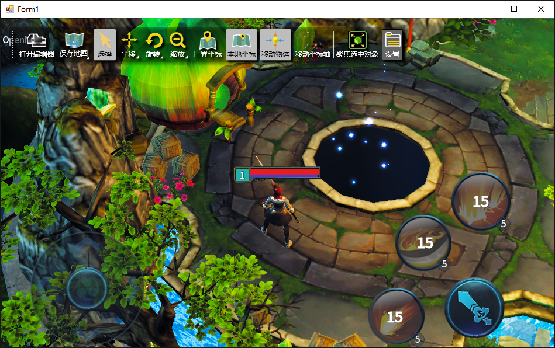
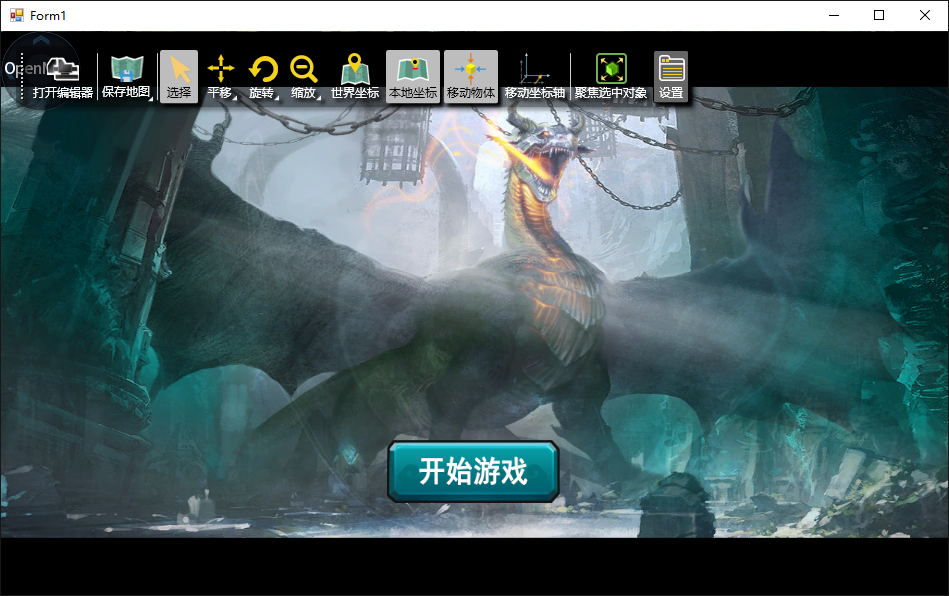

# ViseEngine
Fork of ViseEngine. 

 - 开发环境：VS2015
 
 - 开发语言：C++/C#
 
 - 开发依赖：Mono, xamarin
 
 - 支持平台：Windows, iOS, Android
 
 - 代码包含：引擎代码，40+全部编辑器代码，一套MOBA游戏客户端服务器完整代码和资源
 
 - 特点：Vise3D引擎运用云技术和大数据支持，具有动态云服务器调配技术、跨平台多研发环境、延迟渲染、40+可视化实用工具集、逻辑连线式AI处理、服务器C/解决方案及多线程适用，支持程序语言：C++、C#。

 - 特别申明：
 
Vise3d虽然是一个商业3D引擎，任何人在获得vise3d的源码后，都可以分发给任何其他人学习和使用，但是vise3d的全部或者任意部分被商业项目使用，都必须和vise3d官方联系取得商业授权。
